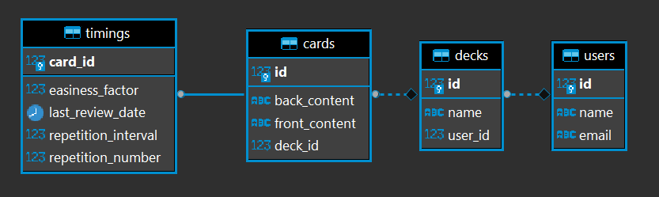

# Flashcard

Flashcard is a REST API built with Spring Boot that uses JPA repository as its persistence layer with a PostgreSQL database. It was created for the purpose of coding practice.

## Table of Contents

* [Description](#Description)
* [How to run](#How-to-run)
  * [1. IDE](#1-IDE)
  * [2. Command line](#2-Command-line)
  * [3. Jar](#3-Jar)
  * [4. Docker container](#4-Docker-container)
* [Dependencies](#Dependencies)


## Description

Flashcard's database consist of 4 tables:
- `users`
- `decks` (of a user)
- `cards` (of a deck)
- `timings` (one for each card)



The API supports basic CRUD operations on all tables, as well as [spaced repetition](https://en.wikipedia.org/wiki/SuperMemo#Description_of_SM-2_algorithm) learning for the cards.

You can find the detailed API information via the default Swagger landing page, once you launch the application.


## How to run

[OpenJDK 11](https://adoptopenjdk.net/?variant=openjdk11&jvmVariant=hotspot) and [PosgreSQL](https://www.postgresql.org/download/) is required! (unless Docker is used)

Tested on Windows 10.

### 0. Setup the database 

Skip this step if docker is used.

Create a user, and a database that is owned by that user.

Set the following environment variables:

1. `FLASHCARD_DB_HOST`

This is the hostname of the computer running the database.

2. `FLASHCARD_DB_PORT`

The port used by the database. (`5432` by default)

3. `NAME_OF_FLASHCARD_DB`

Name of database created.

4. `FLASHCARD_USER`

Username for the owner of the database.

5. `FLASHCARD_PASSWORD`

Password for the username.


### 1. IDE

- [Setup the database.](#0-Setup-the-database)

- Import the project in your IDE with the pom.xml to let maven gather the dependencies.

- Compile.

- Use the `FlashcardApplication` class as the entry point.

- Open [localhost:8080/swagger-ui.html](localhost:8080/swagger-ui.html) in your browser to learn about the endpoints.

### 2. Command line

[Setup the database.](#0-Setup-the-database)

From the project root folder in command line execute:
```console
$ mvnw compile
```
```console
$ mvnw exec:java -Dexec.mainClass=hu.traileddevice.flashcard.FlashcardApplication
```

Open [localhost:8080/swagger-ui.html](localhost:8080/swagger-ui.html) in your browser to learn about the endpoints.

### 3. Jar

[Setup the database.](#0-Setup-the-database)

From the project root folder in command line execute:
```console
$ mvnw package && java -jar target/flashcard-1.0.0.jar
```

Wait for the tests to run.

Open [localhost:8080/swagger-ui.html](localhost:8080/swagger-ui.html) in your browser to learn about the endpoints.

### 4. Docker container

From the project root folder in command line execute:

```console
$ build_and_run_docker_containers.bat
```

Open [localhost:8080/swagger-ui.html](localhost:8080/swagger-ui.html) in your browser to learn about the endpoints.

#### Note

This option launches a separate PostgreSQL container to be used as the database.

You may edit the credentials for the database inside the `docker-compose.yml` file, but it should work by default without any configuration.

The data saved in the database is stored in a volume - named `flashcard-data` - which remains even after the container is deleted.

## Dependencies

* **[Spring Boot Maven Plugin](https://mvnrepository.com/artifact/org.springframework.boot/spring-boot-maven-plugin/2.5.3) 2.5.3**
* **[Spring Boot Starter Parent](https://mvnrepository.com/artifact/org.springframework.boot/spring-boot-starter-parent/2.5.3) 2.5.3**
* **[Spring Boot Starter Web](https://mvnrepository.com/artifact/org.springframework.boot/spring-boot-starter-web/2.5.3) 2.5.3**
* **[Spring Boot Starter HATEOAS](https://mvnrepository.com/artifact/org.springframework.boot/spring-boot-starter-hateoas/2.5.3) 2.5.3**
* **[Spring Boot Starter Data JPA](https://mvnrepository.com/artifact/org.springframework.boot/spring-boot-starter-data-jpa/2.5.3)  2.5.3**
* **[Spring Boot Starter Validation](https://mvnrepository.com/artifact/org.springframework.boot/spring-boot-starter-validation/2.5.3) 2.5.3**
* **[Springdoc OpenAPI UI](https://mvnrepository.com/artifact/org.springdoc/springdoc-openapi-ui/1.5.10) 1.5.10**
* **[Springdoc OpenAPI HATEOAS](https://mvnrepository.com/artifact/org.springdoc/springdoc-openapi-hateoas/1.5.10) 1.5.10**
* **[Spring Boot Starter Test](https://mvnrepository.com/artifact/org.springframework.boot/spring-boot-starter-test/2.5.3) 2.5.3**
* **[Spring Boot DevTools](https://mvnrepository.com/artifact/org.springframework.boot/spring-boot-devtools/2.5.3) 2.5.3**
* **[PostgreSQL JDBC Driver](https://mvnrepository.com/artifact/org.postgresql/postgresql/42.2.23) 42.2.25**
* **[Project Lombok](https://mvnrepository.com/artifact/org.projectlombok/lombok/1.18.20) 1.18.20**
* **[ModelMapper](https://mvnrepository.com/artifact/org.modelmapper/modelmapper/2.4.4) 2.4.4**
* **[H2 Database Engine](https://mvnrepository.com/artifact/com.h2database/h2/1.4.200) 1.4.200**
* **[Flyway Core](https://mvnrepository.com/artifact/org.flywaydb/flyway-core/7.12.0) 7.12.0**
